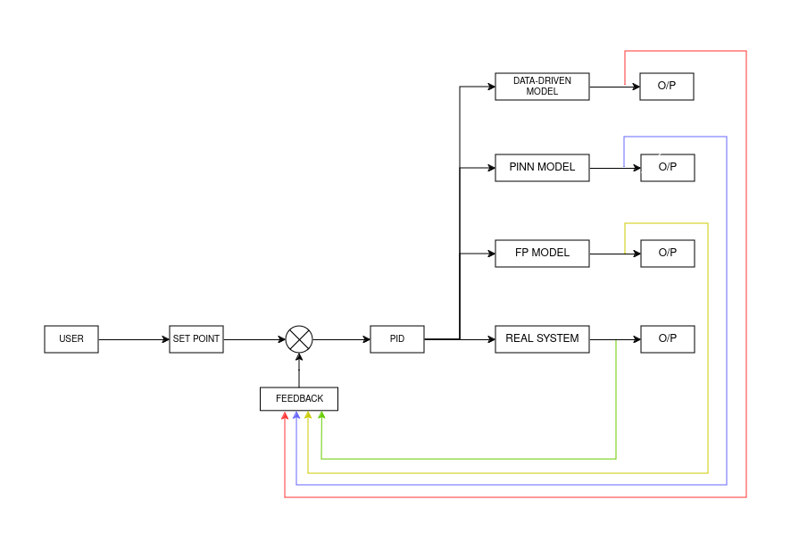

# Development of PI-NN based digital twin of Non Linear tank system

The Governing equation of the system:
$\frac{dh}{dt} = \frac{Q - \frac{\pi}{4} d^2 \sqrt{2g(y - y_0)}}{\Pi (2ry - y^2)}$

We are attempting to replicate the dynamic behaviour defined by this ODE with the help of Neural Networks while incorperating additional process data.

